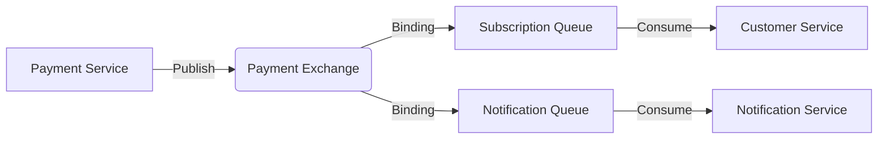

# ⬢ Event-Driven Architecture (EDA) & Messaging

## 1. Interaction Model
Nozie uses **Pub/Sub** and **Work Queues** via **RabbitMQ** to ensure system eventual consistency and high responsiveness.

## 2. Key Business Flows
### A. Successful Payment Flow
1. `Payment Service` completes a transaction with Stripe.
2. `Payment Service` publishes an `ORDER_COMPLETED` message to the `nozie.payment.exchange`.
3. **Consumer 1 (`Customer Service`)**: Updates user subscription duration.
4. **Consumer 2 (`Notification Service`)**: Sends a stylized receipt email.

### B. Movie Content Update
1. `Movie Service` updates movie info.
2. An event triggers a cache invalidation signal.
3. Relevant cache entries in Redis are purged or refreshed.

## 3. Reliability Patterns
- **Retry Mechanism**: Exponential backoff for failed consumers.
- **Dead Letter Exchange (DLX)**: Failed messages are moved to a DLX for manual inspection or delayed retry.
- **Message Acknowledgment**: Manual ACKs to ensure no data loss during processing.

