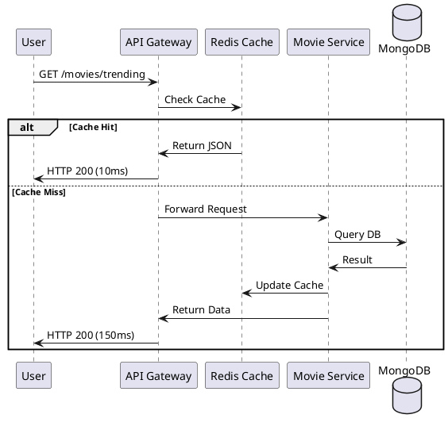

# ⚡ Multi-Layered Caching Strategy

Nozie employs caching at multiple levels to ensure sub-100ms response times for critical operations.

## 1. Gateway Level Caching (Edge)
- **Technology**: Redis 7.2.
- **Goal**: Offload repetitive authentication checks.
- **Optimizations**:
    - **Token Blacklist**: Validated JWTs are checked against a Redis-based blacklist during logout.
    - **Rate Limiting**: Request counters per User/IP are stored in Redis to enforce quotas.

## 2. Service Level Caching (Application)
- **Pattern**: **Cache-Aside**.
- **Services**: `Movie Service`, `Identity Service`.
- **Cached Objects**:
    - **Hot Movie Metadata**: Slugs, titles, and IDs of trending movies.
    - **User Authorities**: Pre-computed Roles and Permissions to avoid complex SQL joins on every request.
- **TTL (Time-To-Live)**: Balanced between 1 hour (Trending) and 24 hours (Static categories).

## 3. Database Level (Internal)
- **MongoDB**: Optimized in-memory working set for movie catalogs.
- **PostgreSQL**: Shared buffer optimization and indexing for transaction logs.

## 4. Content Delivery (CDN)
- **Technology**: CloudFront / Akamai style distribution.
- **Logic**: Static assets (Thumbnails, Posters) and Segmented Video files (HLS) are cached at Edge locations nearest to the user.

