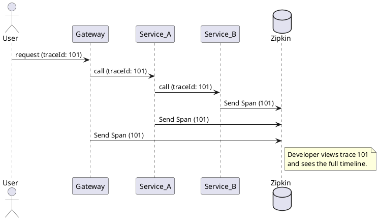

# 🔍 Observability: Distributed Tracing & Monitoring

## 1. Goal
To provide end-to-end visibility of requests across the Nozie microservices ecosystem and monitor the "Golden Signals": **Latency, Traffic, Errors, and Saturation**.

## 2. Technology Stack (Fast-Implementation Vibe)
- **Micrometer Tracing + Brave**: Standard for Spring Boot 3.x observability.
- **Zipkin**: Distributed tracing backend (Single-node Docker setup).
- **Prometheus**: Metric collection (Time-series database).
- **Grafana**: Dashboard visualization.

## 3. Implementation Blueprint

### A. Automatic Trace Correlation
By adding the `micrometer-tracing` bridge, every log entry will automatically include:
`[Service-Name, Trace-ID, Span-ID]`
- **Trace-ID**: Unique ID for the entire request lifecycle.
- **Span-ID**: Unique ID for a specific operation within a service.

### B. Zipkin Dashboard (Port 9411)
- Allows developers to search for traces by ID or Service Name.
- Visualizes the call chain: `Gateway -> Identity -> Payment -> RabbitMQ -> Notification`.
- Quickly identifies slow services or "leaky" connections.

### C. Metrics Collection (Port 8080+/actuator/prometheus)
- Services expose JVM and business metrics.
- **Prometheus** scrapes these endpoints every 15 seconds.
- **Grafana** (Future) can be used to set up alerts (e.g., "Alert me if Payment error rate > 5%").

## 4. Quick Execution Guide
1. **Dependencies**: Add `micrometer-tracing-bridge-brave` and `zipkin-reporter-brave` to the microservices.
2. **Infrastructure**: Add the Zipkin container to the `docker-compose.yml`.
3. **Configuration**: Set `management.tracing.sampling.probability` to `1.0` in the shared configuration.

---

## 5. Visual Flow

