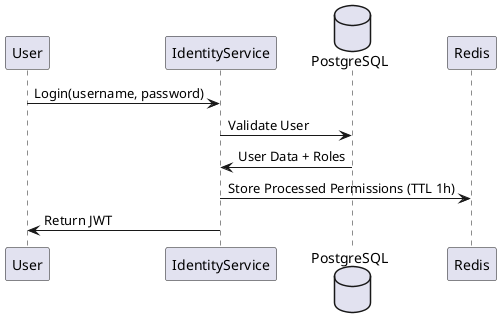

# 🔐 Identity Service: Security & Authority Center

## 1. Role & Architecture
The Identity Service is the source of truth for all users, roles, and permissions. It follows the **RBAC (Role-Based Access Control)** model.

## 2. Optimized Data Flow
1. **Authentication**: Uses BCrypt for password hashing. Generates stateless **JWTs** (Access + Refresh tokens).
2. **Authority Caching**: 
    - When a user logs in, their permissions are pre-computed.
    - These permissions are stored in **Redis** indexed by `userId`.
    - **Optimization**: The API Gateway can fetch permissions directly from Redis to authorize requests without hitting the Identity DB.

## 3. High-Performance Features
- **Token Blacklisting**: During logout, the Access Token is added to a Redis set with a TTL matching its expiration. Gateway checks this list in <1ms.
- **Session Management**: Tracks active devices and allows "Logout from all devices" by invalidating the refresh token family.
- **Audit Logging**: Uses an asynchronous event listener to write audit logs (Login, failed attempts) to prevent blocking the main auth thread.

## 4. Caching Summary
- **Target**: Roles, Permissions, Blacklisted Tokens.
- **Technology**: Redis (In-memory).
- **Update Policy**: Evict cache when a User's role is updated by an Admin.

