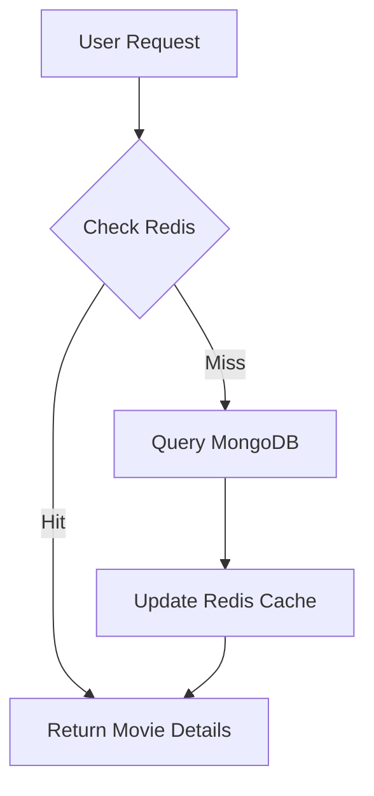

# 🎬 Movie Service: High-Performance Catalog & Discovery

## 1. Domain & Data
Focuses on providing movie metadata, search results, and categories. Uses **MongoDB** for its flexible schema and high-performance read capabilities.

## 2. Reading Optimization (The Core Task)
- **Cache-Aside Pattern**: 99% of movie requests hit **Redis**.
- **Search Optimization**: 
    - Implements **Full-text search** using MongoDB Indexes (or future transition to **Elasticsearch**).
    - Search results are cached based on query parameters (e.g., `genre=Action&year=2024`).

## 3. Streaming Integration Flow
1. User requests a movie.
2. Movie Service verifies the movie ID and retrieves metadata.
3. System checks for **Signed URLs** from the CDN.
4. **Optimization**: The `VideoSource` URL is not stored as a hardcoded link but generated dynamically to prevent hotlinking (Direct access bypassing the app).

## 4. Technical Stack & Caching
- **DB**: MongoDB (Document store).
- **Caching**: Redis (Movies, Trending lists, Category tree).
- **Indexing**: Compound indexes on `(slug, status)`, `(category_id, rating)`.

