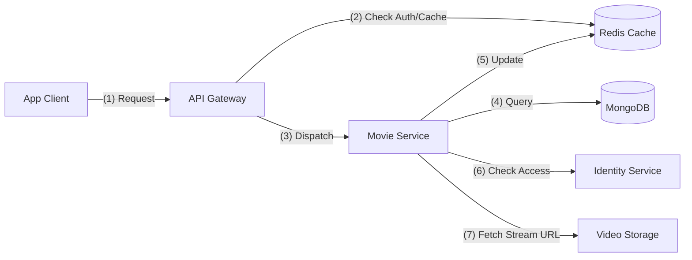

# 🎬 Movie Service: Discovery, Catalog & Streaming Integration

## 1. Hệ thống Nội bộ (Internal System)
Movie Service là trung tâm quản lý toàn bộ kho nội dung của Nozie, tập trung vào hiệu suất cao và khả năng mở rộng.

### Thành phần chính:
- **API Controller Layer**: Cung cấp RESTful APIs cho tìm kiếm, lọc phim, và chi tiết phim.
- **Service Layer**: Xử lý logic nghiệp vụ, tích hợp Caching.
- **Data Access Layer (MongoDB)**: Lưu trữ metadata phim phức tạp, không cấu trúc (Actors, Directors, Episodes) giúp linh hoạt schema.
- **Caching Layer (Redis)**: 
    - Cache danh sách phim "Trending" và "Mới cập nhật".
    - Cache chi tiết phim theo Slug/ID để giảm tải cho MongoDB.

### Mô hình quản lý quyền truy cập (Access Control Models):
Movie Service hỗ trợ 3 loại truy cập (Hybrid Business Model):
1. **FREE**: Mọi người dùng đều có thể xem.
2. **PREMIUM**: Yêu cầu người dùng có gói thuê bao (Subscription). Trạng thái này được check qua gói nhãn trong JWT hoặc cache tại Gateway.
3. **RENTAL**: Phim yêu cầu mua lẻ (mới ra rạp). Yêu cầu check Transaction Record.

---

## 2. Hệ thống Bên ngoài (External Systems Interaction)

Movie Service không hoạt động độc lập mà tương tác với các thành phần trong hệ sinh thái:

### Tương tác Đồng bộ (Sync - Feign Client/Gateway):
- **Identity Service**: 
    - Khi User muốn xem phim PREMIUM/RENTAL, Movie Service (hoặc Gateway) sẽ verify trạng thái tài khoản (User Tier) qua Identity Service.
- **Discovery Server (Eureka)**: Đăng ký instance để Gateway có thể định tuyến yêu cầu.
- **Config Server**: Lấy các tham số cấu hình như MongoDB URI, Redis Host.

### Tương tác Bất đồng bộ (Async - RabbitMQ):
- **Notification Service**: Khi có một bộ phim mới "bom tấn" được thêm vào, Movie Service có thể phát sự kiện để Notification Service gửi thông báo New Movie tới người dùng.

### Hệ thống Lưu trữ - Streaming:
- **Video Storage (CDN/Cloud)**: Movie Service không lưu trữ file video mà lưu trữ link streaming (HLS/m3u8).
- **External Image Storage (ImgBB/AWS S3)**: Lưu trữ Poster và Thumbnail của phim.

---

## 3. Kiến trúc Luồng Dữ liệu (Diagram)

## 4. Tối ưu hóa (Optimizations)
- **Full-text Search**: Sử dụng MongoDB Text Index cho tìm kiếm nhanh.
- **Adaptive Bitrate**: Hỗ trợ chuẩn HLS giúp tự động thay đổi chất lượng video theo tốc độ mạng của người dùng.
- **TTL Caching**: Danh sách phim mặc định có TTL ngắn (ví dụ 5 phút) để đảm bảo dữ liệu luôn mới.
