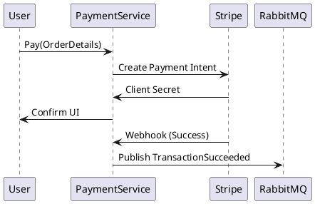

# 💳 Payment Service: Secure Transactions & Idempotency

## 1. Responsibilities
Handles all financial transactions, integration with **Stripe**, and order status management.

## 2. Integrity & Reliability
- **External Integration**: Uses **Stripe Webhooks** to asynchronously update payment statuses.
- **Idempotency**: Every payment request includes an `idempotency_key` (e.g., `order_id`). If the user clicks "Pay" twice, the system detects the key and refuses the duplicate transaction.
- **Distributed Transactions**: Uses **Saga Pattern** (Choreography) via RabbitMQ to ensure consistent state across Payment, Customer (VIP update), and Notification services.

## 3. Flow Design
1. **Initiate**: User selects a plan -> Payment Service creates a "PENDING" transaction.
2. **Authorize**: Hand-off to Stripe.
3. **Capture**: Stripe notifies success -> Payment Service updates to "SUCCESS" -> Emits **`PaymentSucceededEvent`**.

## 4. Optimization
- **Database**: PostgreSQL with row-level locking during status updates.
- **Resilience**: Implements **Retry logic** with exponential backoff for external API calls.

