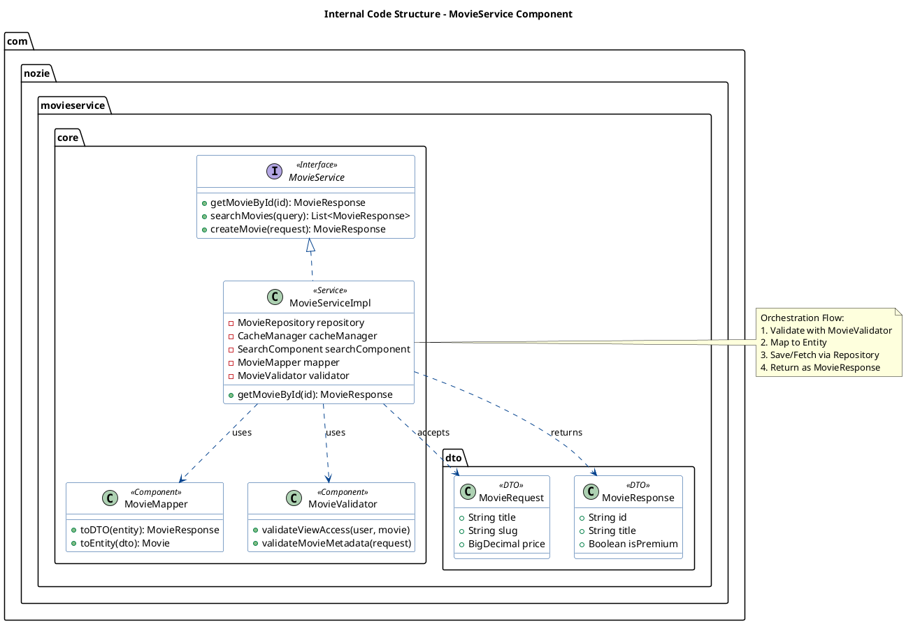

# 💻 C4 Level 4 – Code Diagram (Movie Service Internals)

## 1. Prompt (Detailed)
**Title:** "C4 Level 4: Code Architecture – Movie Service Implementation"

**Description:** 
"Visualize the internal class structure and logic flow within the **MovieService** component. This diagram should show how the service implementation orchestrates data between DTOs, Validators, and external clients to provide a secure and fast movie catalog."

**Visual Requirements:**
- **Central Class:** `MovieServiceImpl` – The main implementation of the `MovieService` interface.
- **Internal Helper Classes:**
    - `MovieMapper`: Handles conversion between `Movie` entities and `MovieResponse` DTOs.
    - `MovieValidator`: Encapsulates business rules (e.g., checking if a user has permission to view VIP content).
    - `SlugEngine`: A utility to generate and validate SEO-friendly slugs for movies.
- **Data Transfer Objects (DTOs):**
    - `MovieRequest`: The input model.
    - `MovieResponse`: The output model sent to the client.
- **Relationships:**
    - `MovieServiceImpl` uses `MovieMapper`, `MovieValidator`, and `SlugEngine`.
    - `MovieServiceImpl` returns `MovieResponse`.
    - Show dependencies to external component interfaces: `SearchClient`, `CacheManager`, and `MovieRepository`.

**Style:** High-resolution UML Class Diagram with a clean, professional layout. Use a tech-focused dark or light theme with distinct colors for Interfaces, Classes, and DTOs.

---

## 2. Code Component Description
This level focuses on the **Implementation Detail** of the Movie Service logic:
- **MovieServiceImpl**: Coordinates the sequence of operations: Validates request -> Checks Cache -> Hits DB if needed -> Maps to DTO -> Returns.
- **MovieMapper**: Ensures the internal database structure (Entity) never leaks to the API layer, maintaining a clean abstraction.
- **Business Logic Units**: Specialized objects like `MovieValidator` keep the service class clean and testable by separating business rules from orchestration.
- **DTOs**: Immutable objects designed for efficient data transport over the network.

---

## 3. PlantUML Diagram

