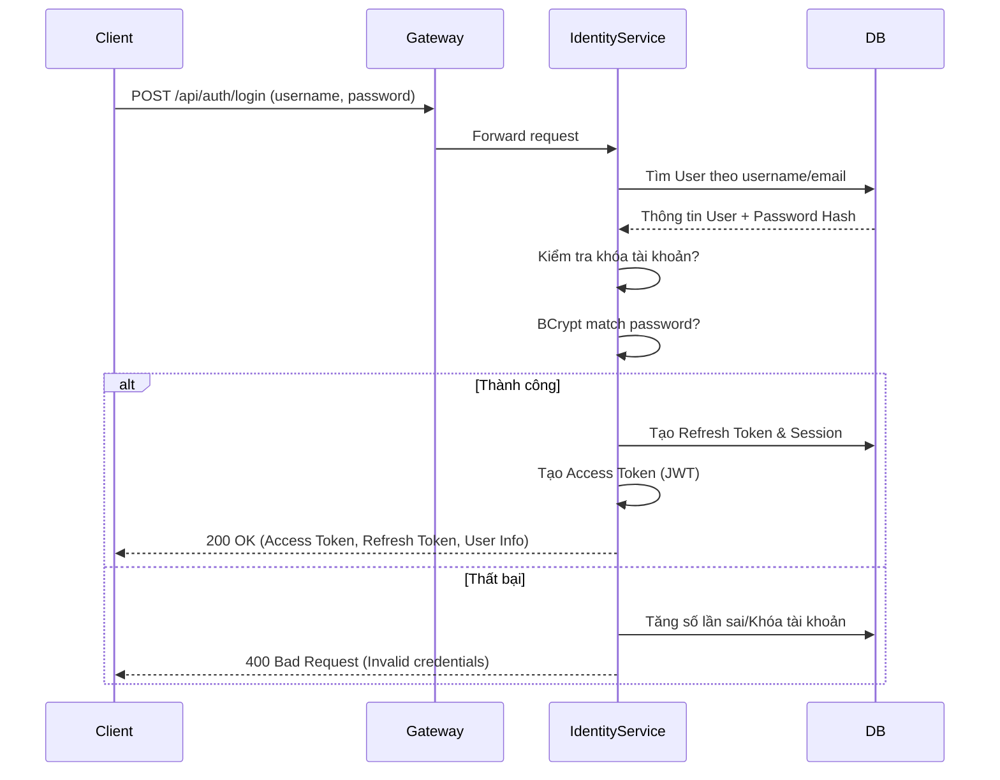
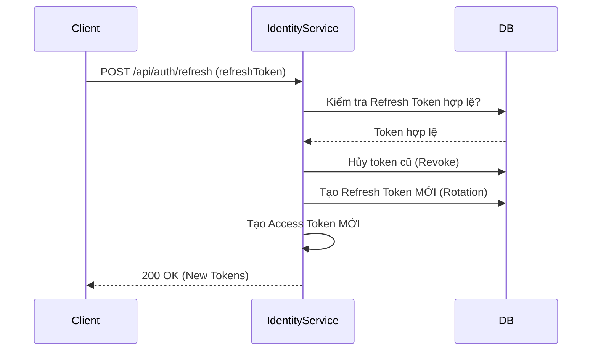

# 🔐 Nozie Identity Service

Identity Service là trung tâm quản lý danh tính và bảo mật của hệ thống Nozie. Nó chịu trách nhiệm xác thực người dùng (Authentication), phân quyền (Authorization) và quản lý phiên làm việc (Session Management).

---

## 🏗️ 1. Kiến trúc & Công nghệ

- **Framework:** Spring Boot 3.x
- **Bảo mật:** Spring Security 6 (Stateless), JWT (Nimbus JOSE + JWT)
- **Database:** PostgreSQL (lưu trữ User, Roles, Sessions, Audit Logs)
- **Cơ chế Token:**
  - **Access Token:** Ngắn hạn (mặc định 15 phút), chứa Claims và Permissions.
  - **Refresh Token:** Dài hạn (mặc định 7 ngày), cơ chế xoay vòng (Rotation) để tăng tính bảo mật.

---

## 🔄 2. Luồng hoạt động (Sequence Diagrams)

### A. Luồng Đăng nhập (Login Flow)


### B. Luồng Làm mới Token (Token Refresh Flow)


---

## 🚀 3. Danh sách API (API Endpoints)

### Xác thực (Auth)
| Method | Endpoint | Auth | Mô tả |
| :--- | :--- | :--- | :--- |
| `POST` | `/api/auth/register` | No | Đăng ký tài khoản mới. |
| `POST` | `/api/auth/login` | No | Đăng nhập nhận bộ Token. |
| `POST` | `/api/auth/refresh` | No | Làm mới Access Token bằng Refresh Token. |
| `POST` | `/api/auth/logout` | Yes | Đăng xuất session hiện tại. |
| `POST` | `/api/auth/logout-all`| Yes | Đăng xuất tất cả các session của người dùng. |
| `GET` | `/api/auth/me` | Yes | Lấy thông tin chi tiết người dùng hiện tại. |
| `GET` | `/api/auth/validate`| Yes | API nội bộ cho Gateway kiểm tra tính hợp lệ của Token. |

### Quản lý phiên (Sessions)
| Method | Endpoint | Auth | Mô tả |
| :--- | :--- | :--- | :--- |
| `GET` | `/api/auth/sessions` | Yes | Liệt kê các thiết bị/phiên đang đăng nhập. |
| `DELETE` | `/api/auth/sessions/{id}`| Yes | Thu hồi (Revoke) một phiên làm việc cụ thể. |

---

## 🗃️ 4. Cơ sở dữ liệu (Database Schema)

- **`users`**: ID, username, email, password (hashed), status (ACTIVE, DISABLED), failed_attempts, locked_until.
- **`user_profiles`**: Thông tin chi tiết: FullName, DoB, Avatar, Phone, Country, Genres ưa thích...
- **`roles` & `permissions`**: Quản lý phân quyền theo nhóm (RBAC).
- **`refresh_tokens`**: Lưu trữ các token dài hạn, hỗ trợ kiểm tra token đã bị thu hồi hoặc đã sử dụng.
- **`user_sessions`**: Ghi lại lịch sử đăng nhập: IP, Device, User-Agent.
- **`audit_logs`**: Nhật ký bảo mật (Login thành công/thất bại, Đổi mật khẩu...).

---

## 🛠️ 5. Cài đặt & Chạy (Startup)

1. **Yêu cầu:** JDK 17+, PostgreSQL đang chạy (Port 5432).
2. **Biến môi trường:**
   - `JWT_SECRET`: Mã bí mật để ký Token (tối thiểu 256 bits).
   - `SPRING_DATASOURCE_URL`: jdbc:postgresql://localhost:5432/identitydb
3. **Lệnh chạy:**
   ```bash
   mvn spring-boot:run -pl identity-service
   ```

---
*Tài liệu nội bộ dự án Nozie.*
